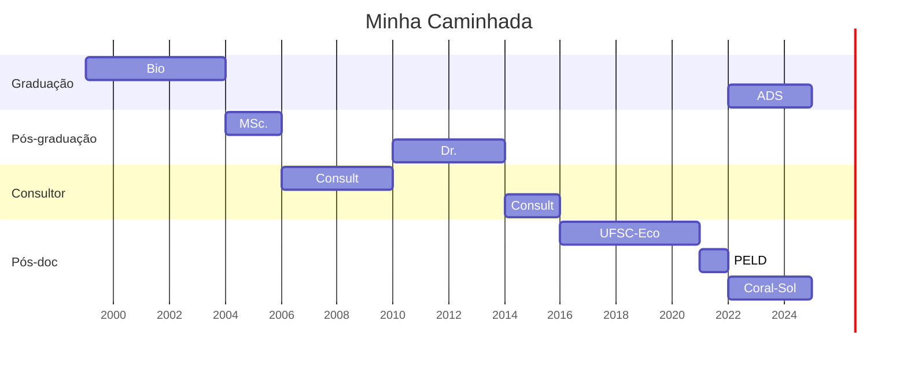

Os primeiros passos sempre são os mais difíceis, mas vamos lá... Antes de mais nada quero me apresentar e compartilhar um pouco da minha jornada. Meu nome é Thiago Silveira, sou biólogo de formação. Desde cedo, sempre nutri um profundo interesse por ciência e tecnologia. Antes de ingressar na graduação em Biologia, passei um ano cursando Processamento de Dados, onde vi um spoiler do que iria trilhar no futuro.

Ao longo dos anos de minha jornada, tive o privilégio de percorrer um caminho acadêmico enriquecedor. Concluí minha graduação em Biologia e, posteriormente, obtive os títulos de mestrado e doutorado em Zoologia. Durante essa trajetória, dediquei-me principalmente ao estudo da ecologia aquática, explorando desde os riachos aos oceanos. Trabalhar como consultor ambiental também foi uma oportunidade valiosa que me permitiu aplicar meus conhecimentos no mercado de trabalho.

Abaixo, apresento um gráfico que ilustra os principais marcos da minha formação e experiência profissional.

>Diagrama de Gantt gerado com [Mermaid](https://mermaid.js.org/)/ADS - Graduação Análise e Desenvolvimento de Sistemas*

Olhando para trás, percebo que minha jornada sempre foi impulsionada pela **análise de dados**. Como disse uma vez o Tio Ed: "Sem dados, você é apenas mais uma pessoa com uma opinião" - uma citação que sempre fez muito sentido a cada problema que tento resolver.

>"Without data, you’re just another person with an opinion."
-W. Edwards Deming
{: .prompt-tip }

Cada questão ecológica que enfrentei exigiu uma abordagem fundamentada em dados. Foi necessário mergulhar de cabeça nos estudos de estatística para compreender profundamente o que estava fazendo e aplicar as melhores estratégias de análise. Cometendo erros ao longo do caminho, aprendi valiosas lições. No início, utilizei as ferramentas disponíveis na época, como SPSS, Pest e Multiv. No entanto, com o surgimento da linguagem R e sua crescente comunidade, tornei-me um usuário ávido. Nesta época a [**R language**](https://cran.r-project.org/) estava no *hype* sendo amplamente adotada em artigos científicos durante meados dos anos 2000, até hoje.

Desde 2020, venho aprofundando meus conhecimentos em desenvolvimento web, com foco em HTML, CSS, JavaScript, MySQL e PostgreSQL, além de me dedicar mais ao Python. Atualmente, considero-me em transição de carreira, explorando um vasto mundo de oportunidades para aplicar minhas habilidades em *Data Science* e um pouco de desenvolvimento web. Desde 2022, estou cursando Análise e Desenvolvimento de Sistemas, aprimorando ainda mais minha expertise em tecnologia.

Daqui para frente, não consigo me imaginar fazendo outra coisa que não esteja relacionada à extração, limpeza, análise e interpretação de dados, construção de modelos, teste de hipóteses, criação de dashboards e uso de modelos Machine Learning. Nas próximas postagens vou trazendo algumas ferramentas que utilizei em trabalhos que participei. Estou entusiasmado com a oportunidade de explorar paralelos entre minha experiência na pesquisa acadêmica e o mundo do *Data Science* aplicado em produção. Espero que estas reflexões possam contribuir de alguma forma na caminhada de pessoas com caminhos similares ao que estou trilhando.

Dale!