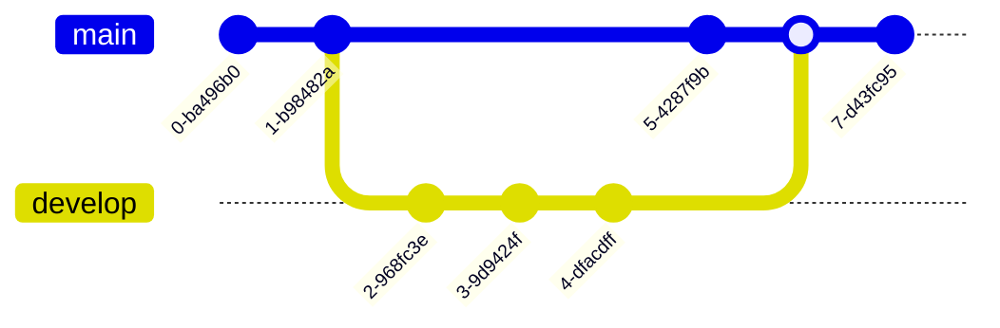

Quem nunca nomeou um arquivo como “final”? Depois de algumas releituras e correções você salva com outro nome, “final_2”. Depois desta versão, alguém analisa e faz observações, e você prontamente salva o arquivo como “final_2_fulano_version”, e assim por diante. Imagine este mesmo documento ficando na “geladeira” por alguns meses e você quer retornar de onde parou. Ainda existe a opção de alguém fazer alterações e não mudar o nome do arquivo. Neste momento fica muito difícil saber onde parou, ainda mais podendo surgir a dúvida de qual é o arquivo mais antigo.

Nomear arquivos com diferentes nomes é uma maneira intuitiva de se fazer controle de versão de arquivos, funcionando para problemas menos complexos. No entanto, quando trabalhamos em grupos, com várias pessoas editando códigos em `R`, se torna impossível gerenciar o histórico das versões dos arquivos. Felizmente existem ferramentas que nos auxiliam no controle de versão, uma delas é o GIT.

## Git

Lançado em 2005, [GIT](https://git-scm.com/) é um software de controle de versão livre. Esta ferramenta permite o rastreamento de alterações em qualquer tipo de conjundo de arquivos em um repositório. O uso do controle de versão permite velocidade no trabalho e integridade de dados, muito indicado em trabalhos em grupo. Ainda, permite a evolução dos projetos em caminhos paralelos. Todo o diretório de arquivos onde o Git está, toda e qualquer mundança é identificada e recuperável.

Linus Torvalds criou o Git para o desenvolvimento do sistema operacional Linux Kernel. Segundo o próprio autor Git significa [Git - The Stupid Content Tracker](https://linux.die.net/man/1/git). Existem outros programas de controle de versão, no momento o Git é um dos mais utilizados pela comunidade de desenvolvedores.

## Exemplo de versionamento

A estrutura do controle de versão usado no Git assemelha-se a uma árvore, tendo um ramo principal chamado de `main`. O ramo `main` pode ter ramos paralelos que podem evoluir, crescer, juntamente com o `main`. O diagrama abaixo ilustra o histórico de versões de um diretório (ou REPO). Cada círculo representa um `commit`, ou seja, uma versão do repo. Vários `branches` podem ser criados e ter um histórico de versões indenpendente um do outro.

No diagrama ilustro a criação de novo `branch` que evolui em paralelo com o branch `main`.

Neste diagrame é ilustrado o `merge` do `branch` develop com o `main`.

## Github

[Github](https://github.com/) é um serviço para desenvolvimento de software sob controle de versão (Git). Em uma definição mais simplificada, pode-se dizer que o Github é uma rede social onde desenvolvedores compartilham e desenvolvem repositórios com códigos, tudo com controle de versão. No Github é possivel seguir e acompanhar perfis pessoais e de organizações, além de acompanhar projetos em desenvolvimento de software livre. No github também é possível publicar páginas na internet usando os recursos do Github Pages (Assunto para um futuro post).

| Git                                       | Github                                     |
| :---------------------------              | :---------------                           |
| É um software                             | É um serviço                               |
| Instalado localmente em sua máquina       | Está em um servidor                        |
| Usado em linha de comando                 | Apresenta interface gráfica                |
|Gerecia diferentes versões em um repo Git  | Armazenar uma cópia de seu repositório Git |
|Funcionalidades VCS para gerenciar versões | Funcionalidades VCS dentre outras          |

## Resumo

- Git é um software que permite o versionamento de arquivos em um repositório local.
- Github é um serviço onde se pode armazenar e compartilhar repositórios com controle de versão.
- Cada versão de repositório é recuperável.
- Um repositório pode ter difentes ramos, `branches` independentes.
- Os ramos podem ser unidos via `merge`.

