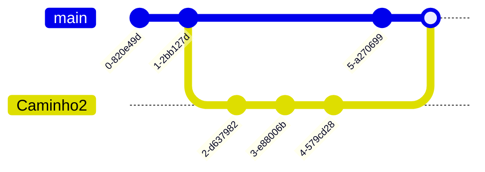

Continuando a saga de introdução ao controle de versão em projetos desenvolvidos no RStudio.
No [post anterior](https://silveiratcl.github.io/posts/github_e_R2/) aprendemos o seguinte:

- Criar um repositório remoto no Github.
- Criar um projeto com controle de versão usando Git no RStudio.
- Clonar o repositório remoto na sua máquina.

Neste post vamos mergulhar fundo no *workflow* de versionamento de código. É preciso ter executado os passos do [post 2 da trilogia](https://silveiratcl.github.io/posts/github_e_R2/) Nos passos a seguir vamos executar as seguintes tarefas com graus de dificuldade do básico ao avançado:

- Básico - Vamos fazer um `commit` e `push`.
- Intermediário -  Vamos criar um `branch` e fazer um `merge`.
- Avançado 1 -  `fork`, `branch`, `pull request` e `merge`.
- Avançado 2 - Analisando `pull request`
- Avançado 3 - Back to The Future - Navegando entre vesões do repositório

## Básico: *commit* e *push*

Agora podemos criar um script teste para fazermos o primeiro `commit` e `push`.
Definindo o que cada comando faz:

- `commit` - registra uma versão do repositório local.
- `push` - envia a vesão atual para o repositório no Github.

Observando o painel Files no RStudio você verá que alguns arquivos foram adicionados. Temos um arquivo **.gitignore**, **.Rhistory** e **teste_repositorio.Rproj**. Criando um novo script e salvando (por exemplo, script_teste.R), o painel **Files** ficará como abaixo.


Após a criar e salvar um script teste, o painel Git deve estar parecido como o abaixo:


Note que estão listados alguns arquivos na aba **Git** do RStudio, toda e qualquer alteração salva neste diretório será listada neste painel. Se você selecionar **staged**  você está aprovando a mundança no arquivo para regitro no futuro `commit`. Em **Status** pode ser A de “added”, M significa “modified” e ainda não adicionado. Alternativamente, você pode digitar `git commit add .` no terminal do RStudio, habilitando todos os arquivos para registro no futuro `commit`.


Com todos os arquivos marcados **Staged**, o próximo passo é fazer um `commit` , ou seja, registrar (ou anotar) todas as alterações realizadas. Todo o `commit` deve ter uma mensagem. Clicando em `commit` você registra as alterações e pode comentar as principais mudanças no campo Commit message, por exemplo. Clique em **commit**  nesta janela **Review Changes**.


Após este passo você irá ver uma janela como a abaixo mostrando a execução do comando commit.


Após isso estamos aptos para fazer o `push` . Clicando em `push` você envia de fato a nova versão para o seu repositório no servidor do Github.


Agora, para ver se deu tudo certo mesmo, confira seu repositório no Github e veja a versão atualizada. Deve estar similar a figura abaixo.


Os passos anteriores podem ser realizados no terminal de comando do RStudio. Basta digitar os seguintes comandos:

```bash
# Adicionando todas as mudanças, "staging"
git add .

# Fazendo o commit
git commit -m "teste commit"

# enviando para o repositório remoto no ramo master
git push origin master

```

## Intermediário: *branch* e *merge*

Os comandos `branch`  e `merge`  são muito úteis quando queremos testar diferentes códigos que podem evoluir paralelamente. Imagine que você quer fazer uma figura e segue uma linha de raciocínio. Depois de se deparar com o resultado final, você percebe que poderia seguir um caminho diferente. Para não perder a primeira versão, que está no ramo master, você pode criar um `branch`, uma diferente abordagem em paralelo.


- `branch` - cria um novo ramo no seu repositório
- `merge` - adiciona as modificações de um ramo em outro

No diagrama abaixo ilustro a criação de um ramo *Caminho2* e o `merge`com o ramo master/main.



O comando git no terminal é `git branch`. No RStudio você pode criar um **novo branch** clicando no botão indicado abaixo.


Depois de criar o novo branch  nomeado Caminho_2, foram realizadas algumas mudanças no script, fazendo um `commit` e `push`  neste ramo. Depois disso, será realizado um `merge`, essa ação vai incorporar as modificações ao ramo principal master. No RStudio somente é possível criar os ramos pela aba Git, para fazer o merge  você terá que usar linha de comando no terminal. Note que na interface de `commit` , temos sempre que preencher o campo `commit message`. Abaixo, em verde, são destacadas as mudanças realizadas, em vermelho como estava na versão anterior.


Para fazer o merge do ramo Caminho_2, primeiro você precisa voltar para o ramo master. Uma maneira mais fácil de se fazer isso é  você pode realizar os passos via o terminal do RStudio. Abaixo os comandos necessários para executar. Mais fácil, pois na interface do RStudio não existe o comando `merge`.

```bash
# trabalhando no ramo "caminho2", antes de fazer o merge você deve ir para o ramos master
git checkout master

# Fazendo o "merge" de "Caminho_2" ao "master"
$ git merge Caminho_2

# Fazendo o "push" para o repositório
$ git push origin master
```
Voltando para o repositório no Github podemos visualizar a versão atualizada, mais *upstream* do repositório no ramo *master*.


## Avançado: *fork*, *branch*, *pull request* e *merge*

Agora que já vimos como fazer as principais ações usando o Git e Github, a partir deste ponto podemos executar um grupo de comandos que consiste na grande vantagem de se usar o Github: a colaboração multiusuário com controle de versão. Abaixo um resumo dos comandos a serem abordados:

- `fork` - copia um diretório remoto do Github
- `branch` - cria um novo ramo no seu repositório
- `pull request` - solicita permissão para contribuir em um repositório
- `merge` - incorpora o ramo criado ao ramo "master"

Avançando no nível avançado...

Para colaborar em um repositório você antes de mais nada precisa copiar os arquivos para o seu Github. Essa ação é executada com o comando `fork` no Github . Proponho o seguinte exercício, se dirija ao respositório de [teste](https://github.com/silveiratcl/teste_repositorio) e localize no alto da página o botão fork. Depois escolha onde você gostaria de colocar, escolha seu usuário. No canto esquerdo da página mostrará que o repo está em seu usuário também.


Agora faça novamente os passos descritos para a criação de repositório descritos no [post anterior](https://silveiratcl.github.io/posts/github_e_R2/).

> Importante - Tenha certeza de criar uma nova pasta fora das pastas
que você já está trabalhando com versionamento.
{: .prompt-tip }

Faça alguma alteração no script, depois faça `commit` e `push` . Note que seu repositório será atualizado. Navegue até o seu respositório recém clonado e clique em Contribute.


Aparecerá uma nova página comparando o script antigo com o novo.


Clique em *Create pull request*. Com o objetivo de facilitar a colaboração, é eficiente você comentar o objetivo da sua contribuição.


Clique novamente no botão Create pull request para confirmar sua contribuição.
Agora que você fez um *pull request* , basta você aguardar o adminstrador do repositório analisar sua sugestão e fazer o `merge`  no ramo master. Veremos como isso será realizado na seção a seguir.

## Avançado 3: Analisando o *pull request*

Agora que foi realizado o *pull request* , o proprietário do repositório vai analisar as mundanças propostas e fazer o `merge` no ambiente do Github. Se você é o proprietário do repositório, você deverá navegar no repo clicando na guia *Pull requests*.


Você verá  a indicação de pull request  que podem ser analizados. Clique em um dos disponíveis.


Abrindo o pull request  você verá algumas guias como: *conversation*  (conversa sobre as mundanças), *commit*  (lista de commits), *checks*  (conferidos) e *files changed*.

A mais importante delas é a guia *files changed*, nesta são destacadas as mudanças, em vermelho a versão antiga e verde a mudança.


Depois de analisar as mundanças você pode fazer `merge`, ou seja, incorporar a mudança ao ramo master. Na guia `pull request` será indicado que a mundança foi incorporada ao ramo master.

## Back To The Future: navegando entre as versões do repositório

### Visualisando as versões
Com o andamento do trabalho em um diretório, o usuário pode vir a querer retornar a uma versão antiga. Como o diretório está em controle de versão via Git, as versões antigas podem ser recuperadas facilmente. A visualização de versões anteriores pode ser realizadas de duas maneiras:

1) Você pode visualizar a lista de versões de seu diretório usando o comando `git log --oneline`. Serão listados códigos de cada commit com as mensagens escritas em cada um deles. Se quiser visualizar mais detalhes dos commits digite somente `git log`.

2) Você pode também ir para o seu repositório no Github e clicar em commits.


Após clicar em commit, em seguida abrirá uma página onde você pode visualizar a lista de versões do repositório.

### Voltando para um determinado commit (ou versão) do repositório local

Para voltar a uma determinada versão você deve identificar qual commit . Anote o id do `commit` que deseja voltar e rode o seguinte comando no terminal:

```bash
git checkout <id do commit> .
```
> Importante! Não esqueça de colocar espaço e ponto “ .” no final comando. Você não será advertido de nada e vai parecer que funcionou. Sem o “ .” no final do comando você vai sair do ramo e vai poder ficar fazendo commits, e estes commits não serão salvos. Portanto, não esqueça o ponto final “ .”!
{: .prompt-tip }

Após este comando você irá para a versão escolhida na sua máquina local.

### Adicionando a versão atual "Back to The Future" no repositório remoto

Da mesma maneira que você faz `commit` , você tem que também adicionar todos os arquivos desta versão e fazer o `push`. Abaixo fazendo o `commit` com linha de comando no terminal.

```bash
git add .
git commit -m "Voltando ao commit id XXXX"
git push origin

```

## Resumo

- Básico - Aprendemos a fazer `commit` e `push`.
- Intermediário - Criamos um `branch` e fizemos um `merge` de dois ramos.
- Avançado 1 -  Executamos as ações `fork`, `branch`, `pull request` e `merge`.
- Avançado 2 - Vimos como funciona a análise de `pull request` pelo proprietário do repositório.
- Avançado 3 - Navegamos entre vesões do repositório e vimos como se atualiza o repositório remoto com versão mais antiga

## Últimas palavras

Parabéns a todos que conseguiram chegar até aqui. Com o que foi trabalhado na trilogia de **Git, Github e R** você está apto a usar o versionamento em seus projetos usando o RStudio. Este tutorial é uma adaptação de um curso que ministrei para estudantes de graduação no ano de 2021. Atualmente uso Git e Github mais em projetos no editor VSCode, cada editor de código tem sua interface amigável para versionamento. No entanto, recomendo se forçar a usar os comandos Git no terminal, pois quando usar outros editores de código (VSCode, por exemplo), que uso para códigos em Python, vai ser mais fácil o uso. Além disso, o RStudio não possui alguns comando na sua interface (`git merge`, por exemplo), sendo necessário usar o terminal de qualqueer maneira. Ainda, o versionamento usando Git oferece inúmeros comandos avançados que você pode ir apredendo com uso no diário conforme a necessidade.

Ufa! Dale!

## Referências e links úteis
[Guides Github](https://docs.github.com/pt)
[Version Control with Git](https://swcarpentry.github.io/git-novice/)
[Happy Git and Github for the useR](https://happygitwithr.com/)
[Version Control with Git and SVN - RStudio](https://support.posit.co/hc/en-us/articles/200532077-Version-Control-with-Git-and-SVN)
[Revert Git repo to previous version](https://medium.com/swlh/using-git-how-to-go-back-to-a-previous-commit-8579ccc8180f)